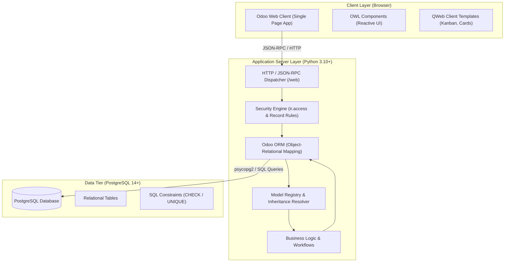
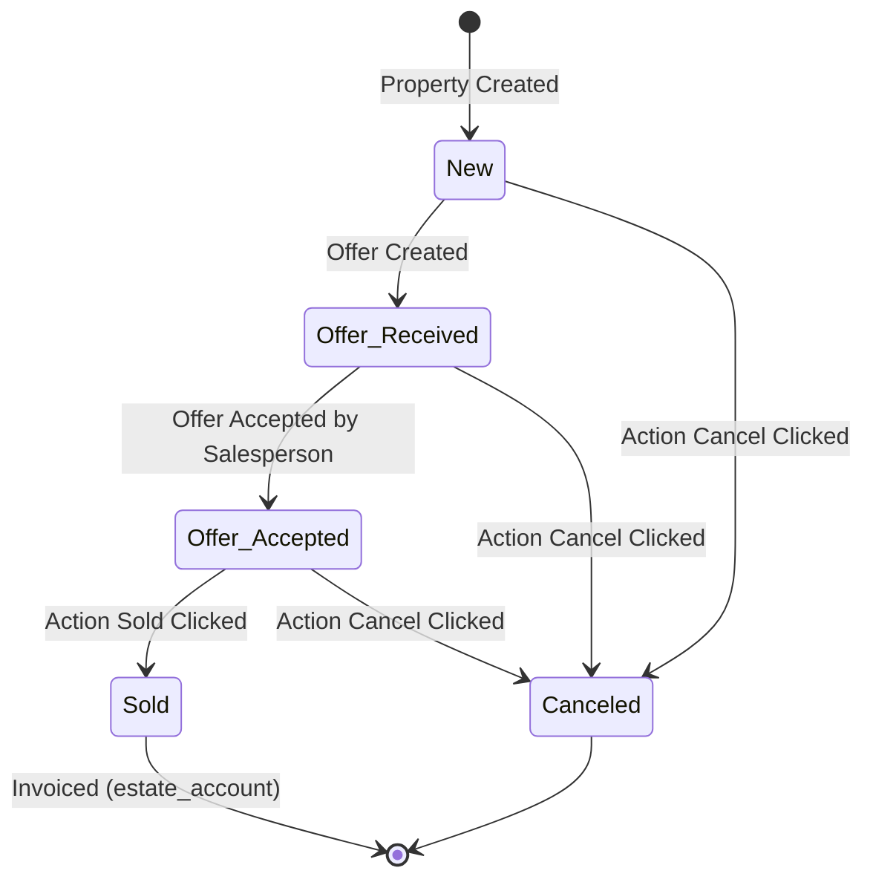
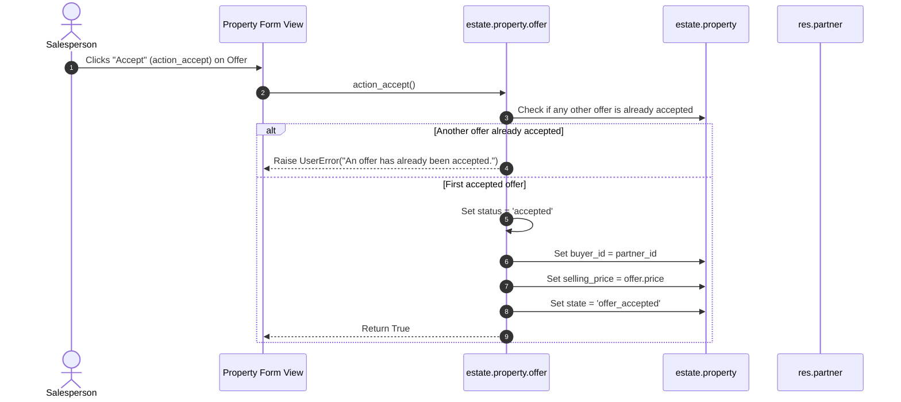

# Odoo 19.4 Real Estate Architecture & Chapter-by-Chapter Technical Guide

Welcome to the comprehensive technical documentation for the **Real Estate Application Suite** (`estate` and `estate_account`), developed following the official **Odoo Developer Tutorial (*Server Framework 101*, saas-19.4)**.

---

# Table of Contents
1. [System Architecture Overview](#1-system-architecture-overview)
2. [Data Model & Entity-Relationship Diagram (ERD)](#2-data-model--entity-relationship-diagram-erd)
3. [Business Workflows & State Machines](#3-business-workflows--state-machines)
4. [Module Ecosystem & Inheritance Patterns](#4-module-ecosystem--inheritance-patterns)
5. [Odoo 19.4 Modernization & Framework Upgrades](#5-odoo-194-modernization--framework-upgrades)
6. [Chapter-by-Chapter Implementation Guide](#6-chapter-by-chapter-implementation-guide)
   - [Chapter 1: Architecture Overview](#chapter-1-architecture-overview)
   - [Chapter 2: A New Application](#chapter-2-a-new-application)
   - [Chapter 3: Models and Basic Fields](#chapter-3-models-and-basic-fields)
   - [Chapter 4: Security – A Brief Introduction](#chapter-4-security--a-brief-introduction)
   - [Chapter 5: Finally, Some UI To Play With](#chapter-5-finally-some-ui-to-play-with)
   - [Chapter 6: Basic Views (List, Form, Search)](#chapter-6-basic-views-list-form-search)
   - [Chapter 7: Relations Between Models](#chapter-7-relations-between-models)
   - [Chapter 8: Computed Fields and Onchanges](#chapter-8-computed-fields-and-onchanges)
   - [Chapter 9: Ready For Some Action? (Business Logic)](#chapter-9-ready-for-some-action-business-logic)
   - [Chapter 10: Constraints (SQL & Python)](#chapter-10-constraints-sql--python)
   - [Chapter 11: Add The Sprinkles (Advanced UI & UX)](#chapter-11-add-the-sprinkles-advanced-ui--ux)
   - [Chapter 12: Inheritance (Python, Model, View)](#chapter-12-inheritance-python-model-view)
   - [Chapter 13: Interact With Other Modules (Link Module)](#chapter-13-interact-with-other-modules-link-module)
   - [Chapter 14: A Brief History of QWeb (Kanban View)](#chapter-14-a-brief-history-of-qweb-kanban-view)
7. [Automated Verification & Testing Strategy](#7-automated-verification--testing-strategy)
8. [Deployment & Operations Manual](#8-deployment--operations-manual)

---

# 1. System Architecture Overview

Odoo is a multi-tier, multi-tenant web application framework. The system architecture divides responsibilities across three distinct computing layers:



### Key Components:
- **Client Layer**: An interactive single-page application built on Odoo's **OWL (Odoo Web Library)** and **QWeb** templating engine, communicating with the server via JSON-RPC.
- **Application Server Layer**: Executes Python code on top of the Odoo ORM. Handles automatic query generation, transaction management, caching, model inheritance resolution, and security evaluations.
- **Data Tier**: PostgreSQL database enforcing relational constraints, storing transactional records, foreign keys, and indexes.

---

# 2. Data Model & Entity-Relationship Diagram (ERD)

The Real Estate system revolves around property advertisement, categorized by types and tags, with competitive bidding offers and accounting integration:

```mermaid
erDiagram
    ESTATE_PROPERTY ||--o{ ESTATE_PROPERTY_OFFER : "receives (offer_ids)"
    ESTATE_PROPERTY }o--|| ESTATE_PROPERTY_TYPE : "categorized as (property_type_id)"
    ESTATE_PROPERTY }o--o{ ESTATE_PROPERTY_TAG : "tagged with (tag_ids)"
    ESTATE_PROPERTY }o--|| RES_USERS : "salesperson (user_id)"
    ESTATE_PROPERTY }o--o| RES_PARTNER : "buyer (buyer_id)"
    ESTATE_PROPERTY_OFFER }o--|| RES_PARTNER : "bidder (partner_id)"
    ESTATE_PROPERTY_OFFER }o--|| ESTATE_PROPERTY_TYPE : "related type (property_type_id)"
    ACCOUNT_MOVE ||--o{ ACCOUNT_MOVE_LINE : "contains (invoice_line_ids)"
    ESTATE_PROPERTY ..> ACCOUNT_MOVE : "triggers invoice on sale"

    ESTATE_PROPERTY {
        int id PK
        string name
        text description
        string postcode
        date date_availability
        float expected_price
        float selling_price
        int bedrooms
        int living_area
        int facades
        boolean garage
        boolean garden
        int garden_area
        string garden_orientation
        boolean active
        string state
        int total_area
        float best_price
    }

    ESTATE_PROPERTY_TYPE {
        int id PK
        string name
        int sequence
        int offer_count
    }

    ESTATE_PROPERTY_TAG {
        int id PK
        string name
        int color
    }

    ESTATE_PROPERTY_OFFER {
        int id PK
        float price
        string status
        int validity
        date date_deadline
        date create_date
    }

    ACCOUNT_MOVE {
        int id PK
        int partner_id FK
        string move_type
        string state
    }

    ACCOUNT_MOVE_LINE {
        int id PK
        string name
        float quantity
        float price_unit
    }
```

---

# 3. Business Workflows & State Machines

### 3.1 Property Lifecycle State Machine
Properties transition through a strict linear lifecycle. Invalid transitions (e.g. selling an already canceled property or canceling an already sold property) are blocked by the ORM via `UserError`.



### 3.2 Offer Acceptance & Rejection Workflow


---

# 4. Module Ecosystem & Inheritance Patterns

The project demonstrates all 4 primary inheritance patterns available in Odoo:

```mermaid
graph LR
    subgraph Core["Odoo Base / Core"]
        ResUsers["res.users (User Model)"]
        BaseViewUsers["base.view_users_form (User XML View)"]
        AccountMove["account.move (Invoicing Model)"]
    end

    subgraph EstateModule["estate Module"]
        EstateProperty["estate.property"]
        EstateOffer["estate.property.offer"]
        ResUsersExt["res.users (_inherit)"]
        UsersViewExt["res_users_views.xml (xpath extension)"]
    end

    subgraph LinkModule["estate_account Module (Bridge)"]
        EstatePropertyExt["estate.property (_inherit)"]
    end

    ResUsersExt -.->|Model Inheritance| ResUsers
    UsersViewExt -.->|View Inheritance| BaseViewUsers
    EstatePropertyExt -.->|Method Extension (action_sold)| EstateProperty
    EstatePropertyExt ==>|Creates Invoice via Command.create| AccountMove
```

1. **Python CRUD Method Overriding**: Altering standard methods (`create`, `unlink`) to enforce business rules.
2. **Model Inheritance (`_inherit`)**: Adding fields (`property_ids`) to standard models (`res.users`).
3. **View Inheritance (`<xpath>`)**: Injecting new notebook pages into upstream views (`base.view_users_form`).
4. **Decoupled Link Modules (`estate_account`)**: An independent module that extends functionality only when both parent dependencies (`estate` and `account`) coexist.

---

# 5. Odoo 19.4 Modernization & Framework Upgrades

During the development of this tutorial on **Odoo 19.4 (saas-19.4 / 20.0)**, several critical framework evolutions were accounted for:

| Feature | Legacy Approach (Odoo 14–17) | Modern Approach (Odoo 19+) | Reason / Benefit |
|:---|:---|:---|:---|
| **SQL Constraints** | `_sql_constraints = [('name_uniq', 'UNIQUE(name)', 'Msg')]` | `_check_name = models.Constraint('UNIQUE(name)', 'Msg')` | Class attribute declaration allows modular inheritance and dynamic overriding without tuple list manipulation. |
| **Security Architecture** | `ir.model.access.csv` + `ir.rule` | `ir.access.csv` unified format | Streamlined permissions model with integrated domain evaluation. |
| **Search View Validation** | `<group expand="0" string="Group By">` | `<group><filter name="group_by_..."/></group>` | RelaxNG strict schema prohibits `string` and `expand` attributes on `<group>` inside `<search>`. |
| **Kanban Template** | `<t t-name="kanban-box">` | `<t t-name="card">` | Unified card-based design standard aligned with modern OWL widgets. |
| **Relational Commands** | Tuples `(0, 0, {...})`, `(6, 0, [...])` | `Command.create({...})`, `Command.set([...])` | Type-safe, self-documenting code avoiding error-prone magic integers. |

---

# 6. Chapter-by-Chapter Implementation Guide

---

### Chapter 1: Architecture Overview
- **Goal**: Understand the client-server architecture, relational database mappings, and module discovery mechanism.
- **Key Concepts**:
  - The server loads addons dynamically via `addons_path` in `odoo.conf`.
  - Modules are loaded in dependency order specified by their `depends` manifest key.

---

### Chapter 2: A New Application
- **Goal**: Initialize an empty Odoo module with proper metadata.
- **Implementation**:
  - Created directory [`estate`](file:///c:/Users/anzixu/Documents/Projects/real-estate-odoo/estate).
  - Created [`estate/__init__.py`](file:///c:/Users/anzixu/Documents/Projects/real-estate-odoo/estate/__init__.py): Root package loader.
  - Created [`estate/__manifest__.py`](file:///c:/Users/anzixu/Documents/Projects/real-estate-odoo/estate/__manifest__.py):
    ```python
    {
        'name': 'Real Estate',
        'version': '1.0',
        'category': 'Real Estate',
        'author': 'Catmuf',
        'depends': ['base'],
        'data': [],
        'installable': True,
        'application': True,
        'license': 'LGPL-3',
    }
    ```
- **Git Commit**: `3a3daad Chapter 2: A New Application`

---

### Chapter 3: Models and Basic Fields
- **Goal**: Create the core `estate.property` PostgreSQL database table using the Odoo ORM.
- **Implementation**:
  - Created [`estate/models/estate_property.py`](file:///c:/Users/anzixu/Documents/Projects/real-estate-odoo/estate/models/estate_property.py) with fields:
    - `name` (`Char`, required)
    - `description` (`Text`)
    - `postcode` (`Char`)
    - `date_availability` (`Date`)
    - `expected_price` (`Float`, required)
    - `selling_price` (`Float`, readonly)
    - `bedrooms` (`Integer`)
    - `living_area` (`Integer`)
    - `facades` (`Integer`)
    - `garage` (`Boolean`)
    - `garden` (`Boolean`)
    - `garden_area` (`Integer`)
    - `garden_orientation` (`Selection`: North, South, East, West)
  - Registered models in [`estate/models/__init__.py`](file:///c:/Users/anzixu/Documents/Projects/real-estate-odoo/estate/models/__init__.py).
- **Git Commit**: `b644772 Chapter 3: Models And Basic Fields`

---

### Chapter 4: Security – A Brief Introduction
- **Goal**: Define Access Control Lists (ACLs) so standard users can read and write property records.
- **Implementation**:
  - Created [`estate/security/ir.access.csv`](file:///c:/Users/anzixu/Documents/Projects/real-estate-odoo/estate/security/ir.access.csv) granting CRUD permissions to `base.group_user`:
    ```csv
    id,name,model_id:id,group_id:id,operation,domain
    access_estate_property,estate.property,model_estate_property,base.group_user,crud,
    ```
  - Added security file to the `'data'` list in `__manifest__.py`.
- **Git Commit**: `8e450cd Chapter 4: Security - A Brief Introduction`

---

### Chapter 5: Finally, Some UI To Play With
- **Goal**: Add default values, reserved attributes, actions, and top-level navigation menus.
- **Implementation**:
  - Added field defaults:
    - `bedrooms = 2`
    - `date_availability = fields.Date.today() + 3 months` (via `relativedelta`)
    - `active = fields.Boolean(default=True)` (soft-archive support)
    - `state = fields.Selection(default='new')`
    - `copy=False` on `selling_price` and `date_availability`
  - Created [`estate_property_action`](file:///c:/Users/anzixu/Documents/Projects/real-estate-odoo/estate/views/estate_property_views.xml) (`ir.actions.act_window`).
  - Created [`estate/views/estate_menus.xml`](file:///c:/Users/anzixu/Documents/Projects/real-estate-odoo/estate/views/estate_menus.xml):
    - Root Menu: `Real Estate`
    - First Level: `Advertisements`
    - Action Menu: `Properties`
- **Git Commit**: `93714c6 Chapter 5: Finally, Some UI To Play With`

---

### Chapter 6: Basic Views (List, Form, Search)
- **Goal**: Replace standard auto-generated views with custom, tailored UI layouts.
- **Implementation**:
  - **List View**: Custom columns for title, postcode, bedrooms, living area, expected price, selling price, and availability date.
  - **Form View**: Header with title, 2-column layout (`<group>`), and notebook tab for "Description".
  - **Search View**: Quick filters for title, postcode, living area with custom domain (`[('living_area', '>=', self)]`), custom "Available" filter, and "Group By Postcode".
- **Git Commit**: `61d8e85 Chapter 6: Basic Views`

---

### Chapter 7: Relations Between Models
- **Goal**: Link properties to property types, tags, buyers, salespersons, and offers.
- **Implementation**:
  - Created **`estate.property.type`** (`estate_property_type.py`):
    - `name` (`Char`, required)
    - Inverse relation `property_ids` (`One2many`)
  - Created **`estate.property.tag`** (`estate_property_tag.py`):
    - `name` (`Char`, required)
    - `color` (`Integer`)
  - Created **`estate.property.offer`** (`estate_property_offer.py`):
    - `price` (`Float`)
    - `status` (`Selection`: accepted, refused)
    - `partner_id` (`Many2one` to `res.partner`, required)
    - `property_id` (`Many2one` to `estate.property`, required)
  - Updated `estate.property`:
    - `property_type_id` (`Many2one`)
    - `buyer_id` (`Many2one` to `res.partner`, `copy=False`)
    - `user_id` (`Many2one` to `res.users`, default=current user)
    - `tag_ids` (`Many2many`)
    - `offer_ids` (`One2many` inverse of `property_id`)
  - Added "Settings" menu with actions for Property Types and Tags.
- **Git Commit**: `574d33b Chapter 7: Relations Between Models`

---

### Chapter 8: Computed Fields and Onchanges
- **Goal**: Implement dynamic field recalculations and UI pre-population.
- **Implementation**:
  - **Total Area Compute**:
    ```python
    @api.depends("living_area", "garden_area")
    def _compute_total_area(self):
        for record in self:
            record.total_area = record.living_area + record.garden_area
    ```
  - **Best Offer Compute**:
    ```python
    @api.depends("offer_ids.price")
    def _compute_best_price(self):
        for record in self:
            prices = record.offer_ids.mapped("price")
            record.best_price = max(prices) if prices else 0.0
    ```
  - **Garden Onchange**:
    ```python
    @api.onchange("garden")
    def _onchange_garden(self):
        if self.garden:
            self.garden_area = 10
            self.garden_orientation = "north"
        else:
            self.garden_area = 0
            self.garden_orientation = False
    ```
  - **Offer Validity & Deadline (Compute & Inverse)**:
    - Modifying `validity` recalculates `date_deadline = create_date + validity days`.
    - Modifying `date_deadline` recomputes `validity = date_deadline - create_date`.
- **Git Commit**: `1d397d6 Chapter 8: Computed Fields And Onchanges`

---

### Chapter 9: Ready For Some Action? (Business Logic)
- **Goal**: Implement state transition actions and offer acceptance/refusal logic.
- **Implementation**:
  - **`action_sold` / `action_cancel`**:
    - Throws `UserError("Canceled properties cannot be sold.")`.
    - Throws `UserError("Sold properties cannot be canceled.")`.
  - **`action_accept` / `action_refuse`**:
    - Ensures no duplicate accepted offers (`UserError("An offer has already been accepted.")`).
    - Sets offer status to `'accepted'`.
    - Automatically populates the parent property's `buyer_id` and `selling_price`.
    - Updates parent property state to `'offer_accepted'`.
  - Added action buttons in form headers and list view action buttons with checkmark/cross icons.
- **Git Commit**: `c7fe7e9 Chapter 9: Ready For Some Action?`

---

### Chapter 10: Constraints (SQL & Python)
- **Goal**: Prevent data corruption through database-level checks and business rules.
- **Implementation**:
  - **Database Constraints (`models.Constraint`)**:
    - `estate.property`: `CHECK(expected_price > 0)`
    - `estate.property`: `CHECK(selling_price >= 0)`
    - `estate.property.offer`: `CHECK(price > 0)`
    - `estate.property.tag`: `UNIQUE(name)`
    - `estate.property.type`: `UNIQUE(name)`
  - **Python Constraint (`@api.constrains`)**:
    - Prevents `selling_price` from dropping below 90% of `expected_price` using `float_compare` and `float_is_zero`.
- **Git Commit**: `9c808aa Chapter 10: Constraints`

---

### Chapter 11: Add The Sprinkles (Advanced UI & UX)
- **Goal**: Polish the interface with modern widgets, decorations, and smart buttons.
- **Implementation**:
  - `widget="statusbar"` on `state`.
  - `widget="color_picker"` on tag color and `widget="many2many_tags"` with `color_field`.
  - `widget="handle"` on property type sequence for manual drag-and-drop reordering.
  - Smart Button on Property Type with `widget="statinfo"` displaying `offer_count`.
  - `editable="bottom"` on offers and tags list views.
  - Dynamic `invisible` expressions hiding buttons based on state.
  - Semantic list row color decorations: `decoration-success`, `decoration-bf`, `decoration-muted`, `decoration-danger`.
- **Git Commit**: `bac2b85 Chapter 11: Add The Sprinkles`

---

### Chapter 12: Inheritance (Python, Model, View)
- **Goal**: Extend existing Odoo models, views, and standard CRUD behaviors.
- **Implementation**:
  - **`@api.ondelete`**: Prevents deletion of a property unless state is `'new'` or `'canceled'`.
  - **`create` override**: Automatically sets property state to `'offer_received'` when an offer is created, and raises `UserError` if the new offer price is lower than an existing offer.
  - **Model Inheritance**: Extended `res.users` in [`estate/models/res_users.py`](file:///c:/Users/anzixu/Documents/Projects/real-estate-odoo/estate/models/res_users.py) adding `property_ids` (`One2many` to `estate.property`, domain-filtered to available properties).
  - **View Inheritance**: Created [`estate/views/res_users_views.xml`](file:///c:/Users/anzixu/Documents/Projects/real-estate-odoo/estate/views/res_users_views.xml) extending `base.view_users_form` via `<xpath expr="//notebook" position="inside">` with a "Real Estate Properties" page.
- **Git Commit**: `84de37a Chapter 12: Inheritance`

---

### Chapter 13: Interact With Other Modules (Link Module)
- **Goal**: Decouple accounting integration into a dedicated link module.
- **Implementation**:
  - Created standalone module [`estate_account`](file:///c:/Users/anzixu/Documents/Projects/real-estate-odoo/estate_account) depending on `estate` and `account`.
  - Overrode `action_sold()` in [`estate_account/models/estate_property.py`](file:///c:/Users/anzixu/Documents/Projects/real-estate-odoo/estate_account/models/estate_property.py):
    ```python
    res = super().action_sold()
    for record in self:
        self.env["account.move"].create({
            "partner_id": record.buyer_id.id,
            "move_type": "out_invoice",
            "invoice_line_ids": [
                Command.create({
                    "name": f"Property Sale Commission (6%): {record.name}",
                    "quantity": 1.0,
                    "price_unit": record.selling_price * 0.06,
                }),
                Command.create({
                    "name": "Administrative Fees",
                    "quantity": 1.0,
                    "price_unit": 100.00,
                }),
            ],
        })
    return res
    ```
- **Git Commit**: `1fd720a Chapter 13: Interact With Other Modules`

---

### Chapter 14: A Brief History of QWeb (Kanban View)
- **Goal**: Build an interactive card-based Kanban board using QWeb templating.
- **Implementation**:
  - Added `<record id="estate_property_view_kanban" model="ir.ui.view">`:
    - Root `<kanban default_group_by="property_type_id" records_draggable="0">`.
    - Declared `<field name="state"/>` outside `<templates>`.
    - Template `<t t-name="card">`:
      - Bold Title (`name`).
      - Expected price.
      - Best price (conditionally rendered via `t-if="record.state.raw_value == 'offer_received'"`).
      - Selling price (conditionally rendered via `t-if="record.state.raw_value == 'offer_accepted'"`).
      - Tag badges with colors (`widget="many2many_tags"`).
  - Updated `estate_property_action` with `view_mode="kanban,list,form"`.
- **Git Commit**: `689494e Chapter 14: A Brief History Of QWeb`

---

# 7. Automated Verification & Testing Strategy

Each chapter was verified on a live PostgreSQL database running under WSL (`Ubuntu-24.04`) with Odoo saas-19.4.

### Test Scenarios Executed:
1. **Module Loading & Schema Verification**:
   ```bash
   python3 odoo-bin -c odoo.conf -d odoo-demo -u estate,estate_account --stop-after-init
   ```
   - **Result**: Loaded 88 modules in 1.1s with **0 errors and 0 warnings**.
2. **On-Delete Security**:
   - Deleting properties in `offer_received` or `sold` states raises `UserError: Only new and canceled properties can be deleted.`
3. **Offer Validation**:
   - Creating an offer with price strictly below an existing offer raises `UserError: The offer must be higher than...`
4. **Automated Invoicing**:
   - Transitioning property to `sold` successfully generates an `account.move` (`out_invoice`) with 6% commission line and 100.00 fee line.
5. **Kanban QWeb Parser**:
   - Verified that `get_view(view_type="kanban")` parses and builds the architecture structure without syntax or schema violations.

---

# 8. Deployment & Operations Manual

### Installing the Suite
```bash
# Update local addons list
python3 odoo-bin -c odoo.conf -d <dbname> -u base --stop-after-init

# Install both Real Estate modules
python3 odoo-bin -c odoo.conf -d <dbname> -i estate,estate_account --stop-after-init
```

### Running the Live Web Server
```bash
python3 odoo-bin -c odoo.conf -d <dbname>
```
Access the web client at: `http://localhost:8069/web`
Navigate to **Real Estate** from the main app launcher.
