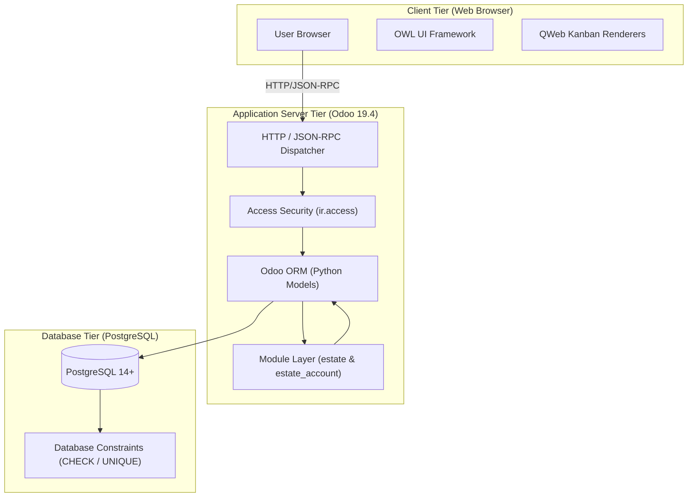
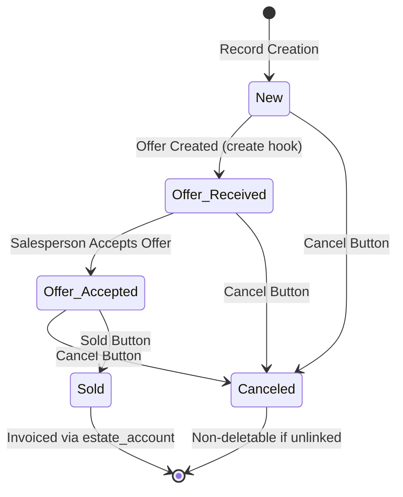
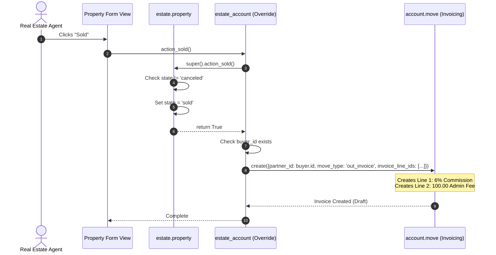

# Architecture & Design

This page provides the architectural blueprints, entity-relationship diagrams, and state machine workflows for the Real Estate application suite.

---

## 1. System Architecture



---

## 2. Entity-Relationship Diagram (ERD)

```mermaid
erDiagram
    ESTATE_PROPERTY ||--o{ ESTATE_PROPERTY_OFFER : "receives"
    ESTATE_PROPERTY }o--|| ESTATE_PROPERTY_TYPE : "typed as"
    ESTATE_PROPERTY }o--o{ ESTATE_PROPERTY_TAG : "categorized with"
    ESTATE_PROPERTY }o--|| RES_USERS : "salesperson"
    ESTATE_PROPERTY }o--o| RES_PARTNER : "buyer"
    ESTATE_PROPERTY_OFFER }o--|| RES_PARTNER : "bidder"
    ACCOUNT_MOVE ||--o{ ACCOUNT_MOVE_LINE : "invoiced lines"
    ESTATE_PROPERTY ..> ACCOUNT_MOVE : "creates upon sale"

    ESTATE_PROPERTY {
        integer id PK
        string name
        text description
        string postcode
        date date_availability
        float expected_price
        float selling_price
        integer bedrooms
        integer living_area
        integer facades
        boolean garage
        boolean garden
        integer garden_area
        string garden_orientation
        boolean active
        string state
        integer total_area
        float best_price
    }

    ESTATE_PROPERTY_TYPE {
        integer id PK
        string name
        integer sequence
        integer offer_count
    }

    ESTATE_PROPERTY_TAG {
        integer id PK
        string name
        integer color
    }

    ESTATE_PROPERTY_OFFER {
        integer id PK
        float price
        string status
        integer validity
        date date_deadline
    }

    ACCOUNT_MOVE {
        integer id PK
        integer partner_id FK
        string move_type
    }

    ACCOUNT_MOVE_LINE {
        integer id PK
        string name
        float quantity
        float price_unit
    }
```

---

## 3. Property Lifecycle State Machine



---

## 4. Cross-Module Invoicing Flow


